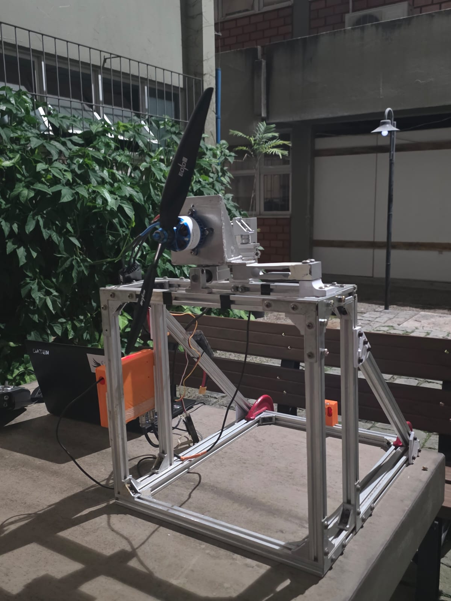

# POLARIS

**P**ropeller **O**bservation, **L**ogging, **A**cquisition and **R**otation **I**nstrumentation **S**tand

> Thrust test rig developed by **Céu Azul Aeronaves** team for characterization of propellers used in SAE Brasil Aerodesign competition aircraft, on Advanced class.

[](https://www.python.org/)
[](https://www.arduino.cc/)
[](LICENSE)
[]()

---

## Overview

POLARIS is a complete acquisition and analysis system for propeller testing — both **static** (free-air hover) and **dynamic** (wind tunnel with inflow velocity). It captures thrust, torque, RPM, and optionally airspeed from an MS4525DO Pitot tube in real time, performs traceable multi-point calibration, automatically extracts steady-state operating points from manual throttle sweeps, computes non-dimensional aerodynamic coefficients (C_T, C_P, C_Q, FOM, J, η), and generates publication-ready PDF reports with cross-reference to the UIUC Propeller Database.

The system was designed around three principles:

- **Traceability** — every measurement carries the calibration ID (SHA-1 hash) and full ambient metadata
- **Repeatability** — automatic detection of steady regimes, hysteresis tracking, and online anomaly detection
- **Practicality** — single-click setup, mobile remote monitor, and one-click PDF report generation

---

## Table of Contents

- [Features](#features)
- [Hardware](#hardware)
- [Installation](#installation)
- [Quick Start](#quick-start)
- [User Guide](#user-guide)
  - [1. Calibration](#1-calibration)
  - [2. Data Collection](#2-data-collection)
  - [3. Analysis](#3-analysis)
  - [4. Test Database](#4-test-database)
  - [5. Remote Monitor](#5-remote-monitor)
- [Technical Details](#technical-details)
- [Project Structure](#project-structure)
- [Troubleshooting](#troubleshooting)
- [Roadmap](#roadmap)
- [License](#license)

---

## Features

### Acquisition
- **Real-time data streaming** from Arduino via USB serial (115200 baud)
- **Two HX711 load cells** for thrust and torque measurement
- **RPM via ESC signal wire** using Pin Change Interrupt with debounce filtering
- **Optional MS4525DO Pitot sensor** (I2C) for airspeed and dynamic pressure measurement
- **Multi-point calibration** with mandatory up/down sweep for hysteresis quantification
- **Pitot tare / zero-offset calibration** before each tunnel run
- **Automatic tare** before each test
- **Configurable moving-average filter** (1–200 samples)

### Analysis
- **Static mode (J = 0)** — hover-style analysis with C_T, C_P, C_Q, FOM
- **Dynamic mode (J > 0)** — wind-tunnel analysis with advance ratio J, propeller efficiency η, and dynamic UIUC comparison
- **Manual sweep extraction** — automatically detects stable plateaus in a CSV from a manual throttle sweep
- **Dual stability mask** — in dynamic mode, plateaus are only accepted where BOTH thrust AND velocity are stable simultaneously
- **FFT spectral analysis** — identifies 1×RPM (imbalance), BPF (blade-pass frequency) and harmonics
- **UIUC database integration** — static (`*_static_*.txt`) and dynamic (`*_<rpm>.txt`) files supported
- **Online anomaly detector** — warns about thrust drops, torque spikes, and RPM oscillations during the test

### Outputs
- **CSV with full metadata** (propeller, motor, battery, Pitot, ambient conditions, calibration IDs, marked events)
- **Parallel JSON file** with structured metadata
- **PDF report** with cover page, calibration summary, sweep table, performance plots, and UIUC comparison (static or dynamic layout)
- **SQLite database** indexing all tests for filtering and multi-test comparison
- **Mobile remote monitor** — HTTP page accessible from any device on the same Wi-Fi; shows Pitot data when active

---

## Hardware

### Bill of Materials

| Component | Model | Notes |
|-----------|-------|-------|
| Microcontroller | Arduino Nano | ATmega328P, 16 MHz |
| Thrust load cell | 10 kg with HX711 | DT=D3, SCK=D4 |
| Torque load cell | 5 kg with HX711 | DT=D5, SCK=D6 |
| RPM sensor | ESC yellow signal wire | D7 (PCINT23) |
| Pitot sensor *(optional)* | MS4525DO | I2C on A4 (SDA) / A5 (SCL); ±1 psi range |
| Motor | Any | 14 poles = 7 pole pairs |
| ESC | Hobbywing Platinum V4 | RPM signal output via yellow wire |
| Propeller | Any | Configurable in test metadata |

### Wiring Diagram

```
Arduino Nano               ESC                       Battery
─────────────              ─────                     ───────
   D3 ─── DT  ┐
   D4 ─── SCK ┤ HX711 #1 (thrust)
   D5 ─── DT  ┐
   D6 ─── SCK ┤ HX711 #2 (torque)
   D7 ────────────────── Yellow (RPM signal)
   A4 (SDA) ─┐
   A5 (SCL) ─┤ MS4525DO Pitot (optional, I2C address 0x28)
   3.3V ─────┘ (power the Pitot from Arduino 3.3V pin)
   GND ───────────────── Black (BEC GND)        ←── CRITICAL: shared ground
   5V ── (USB powered, NOT from BEC)
   USB ── PC
                          Red ── (BEC +5V, NOT connected to Arduino)
                          White ── Receiver throttle channel
```

> ⚠️ **CRITICAL**: The Arduino ground MUST be connected to the ESC ground (BEC black wire or battery negative terminal). Without a common ground, the RPM signal will be unstable and produce nonsensical readings. **DO NOT** connect the BEC red wire (+5V) to the Arduino — the Arduino is powered by USB.

> ℹ️ The MS4525DO operates at 3.3 V. Power it from the Arduino 3.3V pin (max 150 mA, sufficient). Do not connect it to 5V.

### Mechanical Setup

The bench uses an aluminum profile structure with a sliding carriage that pulls a horizontally mounted thrust load cell via a threaded rod. The motor mount is connected to a torque arm whose force is captured by the second load cell. The default torque arm length is 7 cm (configurable in `config.py`).



---

## Installation

### Prerequisites

- **Python 3.10 or newer** (tested on 3.10–3.13)
- **Arduino IDE** (1.8 or 2.x) for firmware upload

### Software setup

```bash
# Clone the repository
git clone https://github.com/ceuazul/polaris.git
cd polaris

# Install Python dependencies
pip install pyserial numpy matplotlib pandas reportlab
```

> **Windows note**: if you get `ModuleNotFoundError: No module named 'serial.tools'`, you have a conflicting package. Fix with:
> ```
> pip uninstall serial pyserial -y
> pip install pyserial
> ```

### Firmware upload

1. Open `firmware_arduino/firmware_arduino.ino` in the Arduino IDE
2. Select **Board**: Arduino Nano
3. Select **Processor**: ATmega328P (try "Old Bootloader" if upload fails)
4. Select the correct **Port**
5. Click **Upload**

You should see in the Serial Monitor (115200 baud) the line `ID:THRUST_RIG_V3` confirming the firmware is running. If the MS4525DO is not connected, the firmware reports `status_pitot=4` (absent) on every line — this is normal and the software handles it gracefully.

### Optional: UIUC Propeller Database

For comparison with reference data, download files from the [UIUC Propeller Database](https://m-selig.ae.illinois.edu/props/propDB.html):

- **Static tests**: place `*_static_*.txt` files in `uiuc_data/`
- **Dynamic tests**: place `*_<rpm>.txt` files in `uiuc_data/` (e.g. `apc10x7_5000.txt`)

### Run the application

```bash
python app.py
```

---

## Quick Start

**Static test (no Pitot):**
```
1. Calibrate thrust and torque cells (one-time setup)
        ↓
2. Connect the rig (Arduino → USB → PC)
        ↓
3. Tare (with motor stopped)
        ↓
4. Click "▶ New Test", fill metadata (type = Static)
        ↓
5. Run the throttle in steps (e.g., 30%, 50%, 70%, 90%, then back down)
        ↓
6. Stop, save CSV
        ↓
7. Go to Analysis tab → Detect plateaus → Generate PDF
```

**Dynamic test (wind tunnel + Pitot):**
```
1. Connect MS4525DO to A4/A5 (I2C)
        ↓
2. In Calibração tab → Pitot sub-tab → calibrate sensor (tare at zero flow)
        ↓
3. Click "▶ New Test", fill metadata (type = Dynamic, Pitot = enabled)
        ↓
4. Set tunnel to target speed — click "TARA Pitot" before each run
        ↓
5. Sweep throttle holding each level for ≥ 6 s
        ↓
6. Save CSV → Analysis shows J, η, C_T(J), C_P(J) automatically
```

---

## User Guide

The application has four main tabs:

| Tab | Purpose |
|-----|---------|
| 📊 **Coleta** (Collection) | Real-time acquisition with live plots |
| ⚖ **Calibração** (Calibration) | Multi-point load cell and Pitot calibration |
| 🔬 **Análise** (Analysis) | Sweep extraction, FFT, UIUC comparison, PDF |
| 🗂 **Ensaios** (Tests) | SQLite database of all tests |

### 1. Calibration

#### Load cells (thrust and torque)

Calibration is **mandatory before the first test** and recommended periodically.

**Procedure:**

1. Open the **Calibração** tab → **Células (empuxo/torque)** sub-tab
2. Select **Empuxo** (thrust) radio button
3. Click **Tarar (zero)** with no load on the cell
4. Place the first known weight (e.g., 500 g), enter the value, select **subida** (going up), click **+ Adicionar Ponto**
5. Repeat with increasing weights until covering the expected range (typical: 0, 500, 1000, 2000, 3000, 5000, 7000 g)
6. Now do the **down** sweep: remove weights in reverse order, switching the direction selector to **descida**
7. Click **📊 CALCULAR REGRESSÃO**
8. Repeat steps 2–7 selecting **Torque** instead
9. Click **💾 Salvar**

**Why up AND down?** Mechanical structures exhibit **hysteresis** — the reading at 1000 g going up is not exactly the same as 1000 g coming down. The difference quantifies the irreducible measurement uncertainty of your bench. Quality criteria:

- **R² ≥ 0.999** → Good
- **Hysteresis < 5 g** → Good
- **R² < 0.99 or hysteresis > 20 g** → Mechanical issues (loose screws, friction, misalignment) — fix before testing

Each calibration receives a **SHA-1 ID hash** that is permanently recorded in every CSV file produced afterward, ensuring full traceability.

#### Pitot sensor (MS4525DO)

1. Open the **Calibração** tab → **Pitot (MS4525DO)** sub-tab
2. Select the sensor variant:
   - **Type B** (default for most MS4525DO-DS3AI modules): `pa_per_count ≈ 0.9352 Pa/count`
   - **Type A**: `pa_per_count ≈ 1.0520 Pa/count`
3. With **zero airflow** (tunnel off, sensor at rest), click **Tarar** — the system averages 200 samples to establish the pressure zero-offset
4. Verify the live reading shows **~0 Pa** and **~0.00 m/s**
5. Click **💾 Salvar calibração Pitot**

The Pitot calibration also receives a SHA-1 ID that is logged in every CSV and database record.

> ℹ️ Repeat the Pitot tare each time ambient pressure changes significantly (e.g., lab temperature shift > 5°C or between test sessions).

### 2. Data Collection

**Before connecting the battery:**

1. Connect the Arduino to the PC via USB
2. Click **Conectar** in the Coleta tab; status should turn green
3. Click **TARA** with the motor mounted but not running

**To start a test:**

1. Click **▶ Novo Ensaio**
2. Fill in the metadata dialog:
   - **Propeller**: pick a preset or enter manually
   - **Motor**: pick a preset — pole pairs default to 7
   - **Battery**: cells, capacity (mAh), initial voltage
   - **Aerodinâmica**: choose **Estático** or **Dinâmico**; enable Pitot if applicable
   - **Ambient conditions**: temperature, pressure, humidity → click **Calcular rho** to compute air density (CIPM-2007 formula)
   - **Operator** and notes
3. Click OK — collection starts immediately

**During the test:**

- The plot shows thrust, torque, RPM (and velocity if Pitot active) in stacked panels
- Numeric indicators show filtered values plus derived quantities (P_mec, T/P, C_T, FOM; and V, q, J, η when Pitot active)
- The "REGIME" label shows whether the signal is steady (green) or transient (orange)
- A configurable moving average smooths the live plot (does not affect saved data)
- **Anomaly detector** displays warnings if it detects sudden thrust drops, torque spikes, or RPM oscillations
- Click **TARA Pitot** at any time to re-zero the Pitot (e.g., between tunnel speed changes)
- Click **🗑 Limpar Gráficos** anytime to reset the plot view (raw data is preserved)
- Click **⚑ Marcar Evento** to mark a timestamp with a label

**Manual sweep procedure:**

For sweep analysis to work later, you need to hold each throttle level **constant for at least 6 seconds** before changing. A typical pattern:

```
0%  →  30% (8s)  →  50% (8s)  →  70% (8s)  →  90% (6s)  →
50% (8s)  →  30% (8s)  →  0%
```

In **dynamic mode**, also ensure the tunnel speed is stable before sweeping throttle. The plateau extractor requires both thrust AND velocity to be stable simultaneously.

**Stopping and saving:**

1. Click **⏹ Parar** when done
2. Click **💾 Salvar CSV**, choose location
3. The system saves three things:
   - `ensaio_<name>_<timestamp>.csv` — full time series with all derived values
   - `ensaio_<name>_<timestamp>.json` — structured metadata
   - The test is automatically indexed in the SQLite database

### 3. Analysis

In the **Análise** tab:

1. Click **📂 Carregar CSV** and pick the test file
2. The system automatically detects **static vs dynamic mode** from the CSV data
3. The full time series is plotted automatically

**Sub-tabs:**

#### Sweep (steady plateaus)

Automatically extracts stable operating points from a manual sweep.

- Adjust **Janela (s)** = window size for std-dev calculation (default 2.0s)
- Adjust **Lim relativo** = relative threshold (3% of local mean by default)
- Adjust **Min dur (s)** = minimum plateau duration to be counted (default 1.5s — increase to 4s for cleaner results)
- Choose **Sinal-base** = `empuxo_g` (thrust-based detection) or `rpm` (RPM-based, often cleaner)
- Click **🔍 Detectar patamares**

**Static mode**: table shows RPM, T, Q, P_mec, T/P, C_T, C_P, FOM with four plots vs RPM.

**Dynamic mode**: table shows J, V, RPM, T, C_T, C_P, η with four plots vs J. The dual-stability algorithm only keeps plateaus where thrust AND velocity are simultaneously stable.

Click **💾 Exportar tabela** to save just the sweep results as CSV.

#### FFT / Spectrum

Spectral analysis of a chosen time segment.

- Set **t inicial** and **Duração** (recommend at least 5s in a steady region)
- Click **🔬 Calcular FFT**

The plot shows magnitude vs frequency for thrust and torque. Vertical red lines mark expected peaks (1×RPM, BPF, harmonics) based on the average RPM in the segment and 2 propeller blades (configurable in code).

#### UIUC

Cross-reference with the UIUC Propeller Database.

- Adjust **Tolerância (in)** if your propeller diameter/pitch doesn't exactly match a database entry
- Click **🔎 Procurar hélice no UIUC**

**Static mode**: searches `*_static_*.txt` files, compares C_T and C_P vs RPM.

**Dynamic mode**: searches `*_<rpm>.txt` files for the nearest RPM, compares C_T, C_P, and η vs J.

#### PDF report

Click **📋 Gerar Relatorio PDF** to export everything as a multi-page PDF.

**Static report**: cover page, calibration summary, sweep table (FOM column), six performance plots vs RPM, UIUC comparison.

**Dynamic report**: cover page with Pitot info, calibration summary (Pitot cal ID and factors), sweep table (J, V, η columns), four performance plots vs J (C_T, C_P, η, thrust), UIUC dynamic comparison.

### 4. Test Database

The **Ensaios** tab shows all tests indexed in the SQLite database (`config_local/ensaios.db`).

- Filter by propeller, motor name, or test type (static / dynamic)
- Select 2+ tests and click **📊 Comparar selecionados** to overlay their curves
- X-axis options: RPM, J, V_med; Y-axis: thrust, torque, power, T/P, C_T, C_P, FOM, J, η
- The table shows peak velocity for dynamic tests; "—" for static

This is essential for comparing propellers, motors, tunnel speeds, or pre/post-modification configurations.

### 5. Remote Monitor

To monitor the test from a phone or tablet on the same Wi-Fi:

1. Check the **Monitor remoto** box in the top toolbar
2. The app shows a URL like `http://192.168.0.15:8765/`
3. Open this URL on the phone's browser

The remote view shows thrust, torque, RPM, and P_mec in large fonts plus a steady-regime indicator, updating twice per second. When Pitot is active, an additional section shows V (m/s), dynamic pressure q (Pa), J, and η.

---

## Technical Details

### RPM measurement

The Hobbywing Platinum ESC outputs one electrical commutation pulse per electrical revolution on the yellow wire. For a motor with N pole pairs, the conversion is:

```
RPM_mechanical = (pulses_per_second × 60) / pole_pairs
```

The Arduino uses Pin Change Interrupt (PCINT23 on D7) with a 400 µs software debounce to filter ESC switching noise.

### Pitot sensor (MS4525DO) conversion

The MS4525DO outputs 14-bit differential pressure counts over I2C (address 0x28). The conversion to Pascals is:

```
raw_pitot       14-bit unsigned, 0–16383
pa_per_count  = 2 × P_range / (count_max - count_min)
              = 2 × 6894.76 / (15565 - 819) ≈ 0.9352 Pa/count  (Type B)
              = 2 × 6894.76 / (14746 - 1638) ≈ 1.0520 Pa/count (Type A)

q_pa  = (raw_pitot - raw_offset) × pa_per_count × k_corr   [Pa]
V_ms  = √(2 × q_pa / ρ)                                    [m/s]
```

`k_corr` defaults to 1.0 (no correction). Set < 1.0 if the Pitot reads high versus a reference anemometer.

Valid for incompressible flow: **V < 30 m/s** (Ma < 0.09). Wind tunnel speeds are typically 5–20 m/s — well within this limit.

### Air density (CIPM-2007 formula)

```
ρ = (P_dry / R_dry × T) + (P_vapor / R_vapor × T)

where:
  P_vapor = RH × 611.2 × exp(17.62 × T / (243.12 + T))
  P_dry   = P_total - P_vapor
  R_dry   = 287.058 J/(kg·K)
  R_vapor = 461.495 J/(kg·K)
  T       in Kelvin
```

Typical accuracy: ±0.1%. Sufficient for aerodynamic coefficient calculations.

### Non-dimensional coefficients

**Static (J = 0):**
```
n = RPM / 60        [rev/s]
T = thrust          [N]
Q = torque          [N·m]
P_mec = 2π × n × Q  [W]

C_T = T / (ρ × n² × D⁴)
C_P = P_mec / (ρ × n³ × D⁵)
C_Q = Q / (ρ × n² × D⁵)
FOM = C_T^1.5 / (C_P × √2)   (Figure of Merit, ideal hover efficiency)
```

Note: FOM > 1 is physically impossible (Betz limit). If observed, it indicates a measurement error.

**Dynamic (J > 0), requires Pitot:**
```
J   = V / (n × D)             (advance ratio — 0 at hover, ~1 at stall)
η   = J × C_T / C_P           (propeller efficiency — max typically 0.7–0.85)
```

FOM is retained in the output but is only physically meaningful at J ≈ 0.

### Calibration model

Linear least-squares fit:

```
raw_count = A × weight + B
weight    = (raw_count - B) / A
```

Hysteresis is computed point-by-point as the difference between the predicted weight on the up vs down sweep.

### Stable-plateau detection (offline)

1. For each sample, compute rolling std-dev in a window of size `janela_s`
2. Mark as stable where `std < max(local_mean × limiar_rel, 5 g)`
3. Group consecutive stable samples into plateaus
4. Discard plateaus shorter than `min_dur_s`
5. Trim 0.4s from each plateau edge to avoid transients
6. In **dynamic mode**: also compute a stability mask for velocity, then take the intersection (a plateau is only accepted where BOTH signals are stable)
7. Compute mean and std of each channel inside the plateau

### Anomaly detection (online)

Three heuristics with 3s cooldown:

1. **Thrust drop**: thrust falls > 15% over baseline (10s window) → possible blade damage
2. **Torque spike**: torque rises > 30% without proportional thrust increase → possible stall
3. **RPM oscillation**: RPM std/mean > 20% in last second → mechanical or ESC issue

### Serial protocol

**V3 (firmware with Pitot):**
```
raw_e,raw_t,pulsos,dt_us,raw_pitot,status_pitot\n
```

**V2 legacy (no Pitot, backward compatible):**
```
raw_e,raw_t,pulsos,dt_us\n
```

Pitot status codes: 0 = OK, 2 = stale reading, 3 = sensor fault, 4 = sensor absent.

---

## Project Structure

```
polaris/
├── app.py                        # Application entry point
├── config.py                     # Constants and paths
├── core/
│   ├── calibration.py            # CalibrationModel + regression + hysteresis
│   ├── serial_reader.py          # Threaded serial reader (V2/V3 auto-detect)
│   ├── pitot.py                  # MS4525DO calibration, Pa/count conversion, V(q)
│   ├── derived.py                # P_mec, C_T, C_P, FOM, J, η, ρ_air
│   ├── stable_detector.py        # Online + offline plateau detector + dual-mask
│   ├── sweep_analyzer.py         # Manual sweep extraction (static + dynamic)
│   ├── anomaly.py                # Online anomaly detector
│   ├── database.py               # SQLite layer with V3 migration
│   ├── uiuc.py                   # UIUC parser (static + dynamic) + comparison
│   ├── fft_analysis.py           # FFT with Hann window
│   ├── remote_server.py          # HTTP server for mobile monitor
│   └── report.py                 # PDF generator (static + dynamic layout)
├── gui/
│   ├── dialogo_metadados.py      # Test setup dialog (aerodynamics tab)
│   ├── tab_coleta.py             # Collection tab (Pitot indicators + TARA)
│   ├── tab_calibracao.py         # Calibration tab (cells + Pitot sub-tabs)
│   ├── tab_analise.py            # Analysis tab (auto static/dynamic mode)
│   └── tab_ensaios.py            # Tests database tab
├── firmware_arduino/
│   └── firmware_arduino.ino      # Arduino firmware V3 (HX711 + ESC + MS4525DO)
├── uiuc_data/                    # ← place UIUC database files here
├── ensaios/                      # CSV outputs (auto-created)
├── relatorios/                   # PDF outputs (auto-created)
├── config_local/                 # calibration, profiles, SQLite DB (auto-created)
└── docs/
    └── CONTEXT.md                # Technical context for developers
```

---

## Troubleshooting

| Symptom | Likely cause | Fix |
|---------|-------------|-----|
| `ModuleNotFoundError: No module named 'serial.tools'` | Conflicting `serial` package | `pip uninstall serial pyserial -y && pip install pyserial` |
| `module 'serial' has no attribute 'Serial'` | Same as above | Same fix |
| Arduino upload fails with "not in sync" | CH340 driver missing or USB cable is power-only | Install CH340 driver; try a different USB cable |
| RPM always 0 | Yellow wire not connected or no common ground | Check D7 wiring; **verify ground is shared between Arduino and ESC** |
| RPM erratic / 100x too high | No common ground | **Connect Arduino GND to ESC BEC ground (black wire)** |
| RPM doubled or halved | Wrong pole pairs in metadata | SunnySky X4120 = 7 pairs; check motor specs |
| FOM > 1 | Torque measured too low or thrust too high | Check torque arm coupling, recalibrate, verify arm length in `config.py` |
| Massive hysteresis (>50 g) | Mechanical issues | Tighten screws, check carriage friction, align thrust cell |
| Sweep detector finds spurious plateaus | Default min duration too short | Increase **Min dur (s)** to 4–5 s |
| App runs but plot is empty | No data flowing | Check serial monitor first; click TARA after connecting |
| Pitot shows "ausente" / status 4 | Sensor not connected | Check A4/A5 wiring; verify 3.3V power |
| Pitot reads nonzero at zero flow | Offset drift | Click **TARA Pitot** with tunnel off before starting test |
| Pitot oscillates ±25% | Electrical noise or slipstream contamination | Shield I2C wires; move Pitot tube upstream of propeller disk |
| Dynamic sweep finds 0 plateaus | Velocity not stable enough | Check tunnel controller; lower `limiar_rel` or `janela_s` in sweep settings |
| η > 1 in dynamic sweep | J computed from wrong D or RPM | Verify propeller diameter (inches, not cm) and pole pair count in metadata |

---

## Roadmap

Planned for future versions:

- [ ] Voltage and current acquisition (INA226 or similar)
- [ ] Automated throttle sweep with safety interlocks
- [ ] Formal uncertainty propagation (GUM-compliant)
- [ ] Vibration measurement (accelerometer integration)
- [ ] Real-time efficiency mapping (T/P heatmap vs RPM/throttle)

---

## License

MIT License — see [LICENSE](LICENSE) file for details.

---

## Acknowledgments

- **Céu Azul Aeronaves** team (UFSC, Brasil) for the bench design and testing
- **University of Illinois at Urbana-Champaign** for the publicly available [Propeller Database](https://m-selig.ae.illinois.edu/props/propDB.html)

---

<p align="center">
  <i>POLARIS</i><br>
  <b>Céu Azul Aeronaves · Advanced 2026 · </b>
  <b> Made by <a href="https://github.com/higor0227">@higor0227</a> and <a href="https://github.com/joaoheck">@joaoheck</a> </b>
</p>
